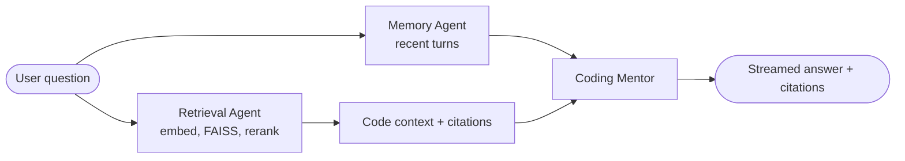
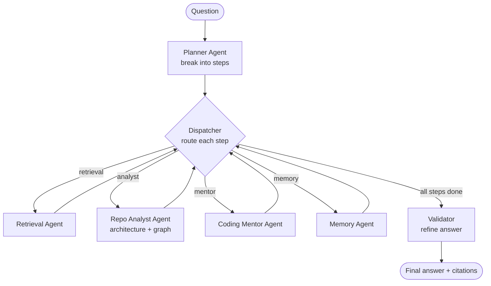

<div align="center">


# Codexa

**Chat with any codebase:** a multi-agent system for semantic code search with grounded, cited answers.

</div>

> Index any public GitHub repo, then ask questions and get answers grounded in the actual code with `file:line` citations. Codexa is a multi-agent system: a LangGraph pipeline of specialized agents (retrieval, memory, mentor) on top of semantic RAG (Vertex AI embeddings + FAISS, not keyword or hash matching) with a lexical reranking step, per-repo conversation memory, real-time token streaming, and a live evaluation dashboard (latency, agent utilization, per-repo stats). Built to make any unfamiliar codebase explorable in plain English.

<div align="center">


</div>

---


## Features

- **Index any public GitHub repo:** paste a URL and Codexa clones, parses, and embeds it.
- **Semantic code retrieval (RAG):** dense vector search using real semantic embeddings (Vertex AI), not keyword or hash matching, followed by a lexical reranking step.
- **Grounded answers with citations:** every answer is built from retrieved snippets and cites exact `file:line` locations, which reduces hallucination.
- **Conversational memory:** per-repo chat history, so follow-ups like "refactor it" or "what about that file?" resolve against earlier turns.
- **Real-time streaming:** answers stream token by token over SSE, with the first words appearing in about 1 to 2 seconds.
- **Code-aware parsing:** tree-sitter extracts functions and classes across roughly 18 languages, and docs/config files (README, YAML, Dockerfile) are indexed too.
- **Dependency graph:** builds and visualizes the import graph of the repo.
- **File explorer:** browse the indexed file tree and preview files.
- **Evaluation dashboard:** live analytics for query count, average and p95 latency, agent utilization, per-repo stats, and recent queries.
- **Multiple embedding backends:** Vertex AI (default, semantic), fastembed (local ONNX, semantic), or hash (lexical fallback), switchable via one env var.
- **Pluggable LLM:** Groq (Llama-3.1-8B) by default through an OpenAI-compatible client, swappable with env vars.

---


## How it works

```
                    Indexing
GitHub URL  ->  git clone --depth 1  ->  tree-sitter parse  ->  embed chunks (Vertex)
                                              |                         |
                                       functions + docs           FAISS index (cosine)
                                              |                         |
                                       import graph (JSON)         persisted to disk

                    Querying
Question  ->  embed (Vertex)  ->  FAISS top-k  ->  lexical rerank  ->  context block
        + recent chat turns  ----------------------------------------------+
                                                                           v
                              Groq LLM  ->  streamed answer + file:line citations
```

- **Embeddings:** Vertex AI `text-embedding-004` (768-dim), true semantic vectors. Indexing is parallelized with token-aware batching plus retry and backoff.
- **Vector store:** FAISS (`IndexFlatIP`, cosine over normalized vectors), held in memory and persisted to disk.
- **Retrieval and reranking:** dense FAISS search retrieves the top-k candidates, then a lexical (token-overlap) reranker reorders them, giving a small hybrid retriever.
- **Generation:** Groq streams a grounded answer, and each snippet is capped to keep latency predictable.

---

## Agent architecture

Codexa is built on a LangGraph multi-agent orchestrator. The production path runs a fast, low-latency subset (Retrieval then Mentor, with Memory threading prior turns). The full graph is available for deeper, multi-step reasoning.

### Production pipeline (fast mode)



### Full multi-agent orchestrator (LangGraph)



**Agents**

| Agent | Role |
|---|---|
| Retrieval | Embeds the query, searches FAISS, reranks, returns grounded snippets and citations |
| Coding Mentor | Generates the final answer or code from retrieved context, in a senior-engineer style |
| Memory | Threads recent conversation turns so follow-ups resolve correctly |
| Planner (full mode) | Breaks a question into steps and routes them to agents |
| Repo Analyst (full mode) | Answers architecture questions using the import graph |
| Validator (full mode) | Reviews and refines the draft answer |

The fast pipeline makes one retrieval plus one LLM call. The full orchestrator trades latency for deeper reasoning.

---

## Tech stack

| Layer | Technology |
|---|---|
| Frontend | Next.js (React), Tailwind CSS, SSE streaming |
| Backend | FastAPI (async, Python 3.11+) |
| LLM | Groq, Llama-3.1-8B-instant (via `langchain-openai`) |
| Embeddings | Vertex AI `text-embedding-004` (fastembed / hash fallbacks) |
| Vector store | FAISS (`faiss-cpu`) |
| Parsing | tree-sitter (`tree-sitter-languages`) |
| Orchestration | LangGraph |
| Graphs | NetworkX (import dependency graph) |
| Metrics | Prometheus |
| Infra | Docker Compose, Caddy (reverse proxy + auto-TLS), GCP Compute Engine, Cloudflare DNS |
| CI | GitHub Actions (ruff, pytest, docker build; Next.js lint + build) |

---

## Project structure

```
codexa/
├── codexa/                     # FastAPI backend
│   ├── app/                    # app factory, DI, security
│   ├── controllers/            # API routes (analyze, ask, files, repos, dependencies, eval)
│   ├── services/
│   │   ├── agents/             # LangGraph orchestrator + agents
│   │   ├── ingestion/          # git clone loader
│   │   ├── parsing/            # tree-sitter AST parser
│   │   ├── retrieval/          # embedders (vertex/fastembed/hash) + FAISS retriever + indexing
│   │   ├── qa/                 # answer service (retrieve, rerank, context)
│   │   ├── dependency/         # import graph builder
│   │   ├── memory/ state/      # conversational + repo state stores
│   ├── observability/          # Prometheus metrics + session tracker
│   └── utils/                  # config, logging
├── codexa-ui/                  # Next.js frontend
│   ├── app/                    # landing, workspace, eval pages
│   └── components/             # Layout (TopBar/drawers), Chat, Sidebar, Panels
├── infra/                      # Caddy config + env files (gitignored secrets)
├── docker-compose.yml
└── Dockerfile
```

---

## Local development

Prerequisites: Python 3.11, Node 20, and either a Vertex AI project (semantic, default) or `CODEXA_EMBEDDING_PROVIDER=fastembed` for fully local embeddings.

**Backend**
```bash
uv venv .venv --python 3.12 && .venv/Scripts/activate   # or python -m venv
uv pip install -r requirements.txt
uv run uvicorn codexa.app.main:app --reload --port 8000
```

**Frontend**
```bash
cd codexa-ui
npm install
npm run dev   # http://localhost:3000
```

### Configuration (`.env`)
```bash
# Embedding: vertex (semantic, default) | fastembed (local semantic) | hash (lexical)
CODEXA_EMBEDDING_PROVIDER=vertex
GOOGLE_CLOUD_PROJECT=your-gcp-project
GOOGLE_CLOUD_LOCATION=us-central1

# LLM
CODEXA_LLM_PROVIDER=groq
CODEXA_LLM_MODEL=llama-3.1-8b-instant
GROQ_API_KEY=your-groq-key

# CORS + storage
CODEXA_ALLOWED_ORIGINS=http://localhost:3000
CODEXA_INDEX_DIR=.codexa/indexes
CODEXA_STATE_DIR=.codexa/state

# Frontend -> backend (build-time)
NEXT_PUBLIC_API_URL=http://localhost:8000
```

Vertex AI uses Application Default Credentials (`gcloud auth application-default login` locally, the VM's service account in production). No API key is needed for embeddings.

---

## Deployment

Containerized and deployed with Docker Compose on a GCP Compute Engine VM:

- Caddy reverse-proxies `app.domain` to the frontend and `api.domain` to the backend, with automatic HTTPS.
- Cloudflare DNS points a reserved static IP at the VM.
- Vertex AI auth comes from the VM's service account (metadata server), so no key files live in the container.

```bash
git pull
docker-compose up -d --build
```

---

## Roadmap

- Incremental re-indexing on git changes (diff plus Merkle-tree change detection)
- Per-user isolation and authentication (multi-tenant)
- Externalized state (managed vector DB plus Postgres) for horizontal scaling
- Indexing via a job queue (Celery) with dedicated workers
- Branch selection (currently indexes the default branch only)
